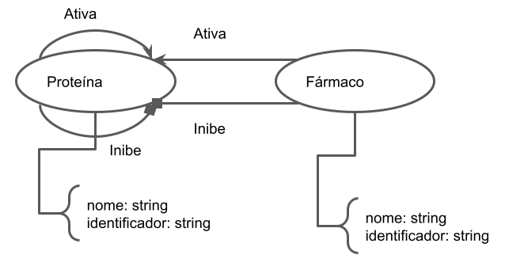

*2024.1 Ciência e Visualização de Dados em Saúde*

# Projeto `Triagem de drogas in silico para Leucemia Linfoide Aguda (LLA)`
# Project `in silico drug screening for Acute Lymphocytic Leukemia (ALL)`

# Descrição Resumida do Projeto

A Leucemia Linfoide Aguda (LLA) é uma neoplasia agressiva e heterogênea que afeta células precursoras de linfócitos, ocorrendo quando há o sequestro das células de seu ciclo normal de diferenciação, alterando vias de proliferação e apoptose e gerando o quadro da doença. Por se tratar de uma doença heterogênea onde casos de recaída tem um prognóstico ruim, os pacientes podem se beneficiar de abordagens baseadas na medicina de precisão, promovendo estratégias terapêuticas pensadas segundo as características moleculares do paciente, buscando o tratamento adequado para evitar recaídas e o desenvolvimento de resistência aos medicamentos. 

Desta forma, buscamos criar um modelo baseado em dados de transcriptômica organizados em uma rede com o objetivo de identificar os grupos de genes mais afetados de um paciente segundo a expressão gênica e qual droga age de forma mais eficiente na rede do paciente. Esta abordagem permite maior liberdade para explorar possibilidades de tratamento ainda in sílico, tornando mais eficiente os esforços in vitro e in vivo, tentando diminuir custos e promover o desenvolvimento de alternativas terapêuticas para os pacientes. 

# Fundamentação Teórica

- A medicina de precisão busca encontrar a droga certa para o paciente certo, utilizando de dados moleculares dos pacientes que englobam ômicas além de somente a genômica - Letai, A. (2017).[[1]](#1)

- A LLA é uma neoplasia agressiva que afeta a linhagens linfóides, alterando a via de diferenciação normal de linfócitos B e T. É um tipo de câncer heterogêneo, onde as características genéticas, de expressão e epigenéticas afetam a resposta ao tratamento e a diferentes drogas - Onciu, M. (2009).[[2]](#2)

- Apesar das taxas de sobrevida chegarem a 80% em países desenvolvidos, ainda 20% dos pacientes sofrem recaídas. E como o tratamento para LLA se baseia em quimioterapia de alta intensidade, esses pacientes não podem depender do aumento das  doses dos medicamentos, precisando de novas estratégias para alcançar a remissão - Cordo’ et al. (2021). [[3]](#3)

# Perguntas de Pesquisa

- As vias moleculares alteradas na LLA se organizam em clusters?
- Esses clusters são alvos potenciais para as classes de fármacos disponíveis que iremos triar in silico?  

# Bases de Dados

Base de Dados | Endereço na Web | Resumo descritivo |
----- | ----- | ----- |
St. Jude Cloud | https://www.stjude.cloud/ | Banco de dados de pacientes pediátricos tumorais. Possui dados de genômica, exoma e transcriptoma completos. |

# Modelo Lógico

No modelo lógico do grafo, há duas relações possíveis entre proteínas: a ativação e a inibição da função de uma pela outra. Fármacos externos também podem causar a ativação e inibição de outras proteínas.

# Metodologia

Exploraremos os conceitos de centralidade, detecção de comunidade, e _link prediction_ para avaliar as interações e possíveis escapes em interações de drogas conhecidas com determinadas proteínas que fazem parte do problema estudado.

# Ferramentas

- [Neo4j](https://neo4j.com/)
- [Cytoscape](https://cytoscape.org/)
- [String DB](https://string-db.org/)

# Referências Bibliográficas

<a id="1">[1]</a> Letai, A. (2017). Functional precision cancer medicine—moving beyond pure genomics. Nature Medicine, 23(9), 1028–1035. https://doi.org/10.1038/nm.4389

<a id="2">[2]</a> Onciu, M. (2009). Acute Lymphoblastic Leukemia. Hematology/Oncology Clinics of North America, 23(4), 655–674. https://doi.org/10.1016/j.hoc.2009.04.009 

<a id="3">[3]</a> Cordo’, V., van der Zwet, J. C. G., Canté-Barrett, K., Pieters, R., & Meijerink, J. P. P. (2021). T-cell Acute Lymphoblastic Leukemia: A Roadmap to Targeted Therapies. Blood Cancer Discovery, 2(1), 19–31. https://doi.org/10.1158/2643-3230.BCD-20-0093 
