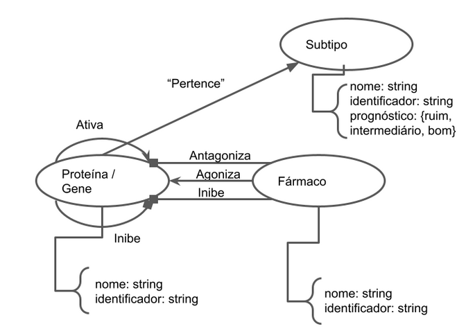
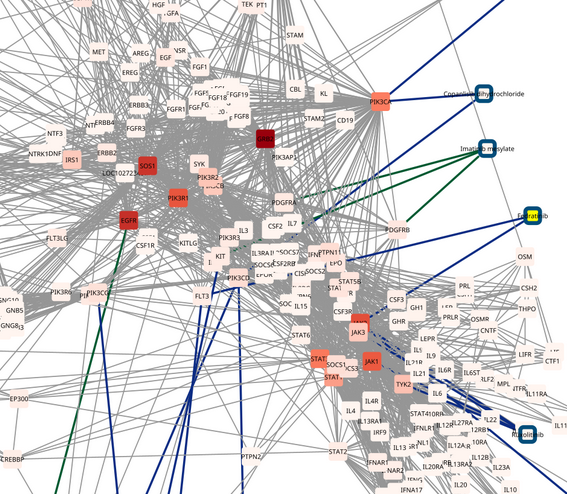

*2024.1 Ciência e Visualização de Dados em Saúde*

# Projeto `Triagem de drogas in silico para Leucemia Linfoide Aguda (LLA)`
# Project `in silico drug screening for Acute Lymphocytic Leukemia (ALL)`

# Descrição Resumida do Projeto

A Leucemia Linfoide Aguda (LLA) é uma neoplasia agressiva e heterogênea que afeta células precursoras de linfócitos, ocorrendo quando há o sequestro das células de seu ciclo normal de diferenciação, alterando vias de proliferação e apoptose e gerando o quadro da doença. Por se tratar de uma doença heterogênea onde casos de recaída tem um prognóstico ruim, os pacientes podem se beneficiar de abordagens baseadas na medicina de precisão, promovendo estratégias terapêuticas pensadas segundo as características moleculares do paciente, buscando o tratamento adequado para evitar recaídas e o desenvolvimento de resistência aos medicamentos. 

Desta forma, buscamos criar um modelo baseado em dados de transcriptômica organizados em uma rede com o objetivo de identificar os grupos de genes mais afetados de um paciente segundo a expressão gênica e qual droga age de forma mais eficiente na rede do paciente. Esta abordagem permite maior liberdade para explorar possibilidades de tratamento ainda in sílico, tornando mais eficiente os esforços in vitro e in vivo, tentando diminuir custos e promover o desenvolvimento de alternativas terapêuticas para os pacientes.

# Slides

Os slides estão disponíveis [aqui](assets/slides/DataSci4Health-P2.pdf).

# Fundamentação Teórica

- A medicina de precisão busca encontrar a droga certa para o paciente certo, utilizando de dados moleculares dos pacientes que englobam ômicas além de somente a genômica - Letai, A. (2017).[[1]](#1)

- A LLA é uma neoplasia agressiva que afeta a linhagens linfóides, alterando a via de diferenciação normal de linfócitos B e T. É um tipo de câncer heterogêneo, onde as características genéticas, de expressão e epigenéticas afetam a resposta ao tratamento e a diferentes drogas - Onciu, M. (2009).[[2]](#2)

- Apesar das taxas de sobrevida chegarem a 80% em países desenvolvidos, ainda 20% dos pacientes sofrem recaídas. E como o tratamento para LLA se baseia em quimioterapia de alta intensidade, esses pacientes não podem depender do aumento das  doses dos medicamentos, precisando de novas estratégias para alcançar a remissão - Cordo’ et al. (2021). [[3]](#3)

# Perguntas de Pesquisa

- As vias moleculares alteradas na LLA se organizam em clusters?
- Esses clusters são alvos potenciais para as classes de fármacos disponíveis que iremos triar in silico?  

# Metodologia

Exploraremos os conceitos de centralidade, detecção de comunidade, e _link prediction_ para avaliar as interações e possíveis escapes em interações de drogas conhecidas com determinadas proteínas que fazem parte do problema estudado.

## Bases de Dados

Base de Dados | Endereço na Web | Resumo descritivo |
----- | ----- | ----- |
St. Jude Cloud | https://www.stjude.cloud/ | Banco de dados de pacientes pediátricos tumorais. Possui dados de genômica, exoma e transcriptoma completos. |
| Dados Hospital Boldrini | Não disponível | Painel de drogas com potencial de serem utilizadas na LLA. |

## Modelo Lógico

No modelo lógico do grafo, há duas relações possíveis entre proteínas: a ativação e a inibição da função de uma pela outra. Fármacos externos podem ser inibidores, antagonistas ou agonistas com relação às proteínas ou seus genes respectivos. A expressão dos genes e proteínas é definida pelo subtipo de alteração molecular, com as proteínas e genes mais expressos em um subtipo específico tendo uma relação de "pertencimento" a ele. Note que os subtipos tem como atributo o prognóstico, que varia entre bom, intermediário e ruim.

## Integração entre bases

## Análise preliminar

### Relações entre fármacos e proteínas/genes

Foram feitos dois grafos mostrando as relações entre os fármacos e os genes e proteínas relacionados à LLA. Para a escolha dos genes no primeiro grafo, foram tomados todos os genes e suas relações envolvidas nas vias [JAK/STAT](https://version-12-0.string-db.org/cgi/network?networkId=bAgBdUuRK1mZ), [RTK-RAS](https://version-12-0.string-db.org/cgi/network?networkId=bWVfL0O5Pasj) e [PI3K](https://version-12-0.string-db.org/cgi/network?networkId=bBdWJrM6gEIf), pelo String DB. Tais vias são as mais relacionadas à doença segundo [[4]](#4). A escolha dos genes no segundo grafo vêm da lista dos 1000 genes mais heterogêneos segundo uma análise de mean absolute deviation (MAD), com relações entre eles também encontradas pelo String DB. Os fármacos foram obtidos através de uma lista dos fármacos com indícios de serem efetivos na LLA, segundo dados do Hospital Boldrini, e a relação deles com os genes foram obbtidas através do DrugBank.

Nos grafos a seguir, os nós com contorno azul são fármacos, enquanto os nós sem esse contorno representam genes/proteínas. As arestas cinzas são relações entre proteínas, enquanto as arestas azuis e verdes são relações em que o fármaco é inibidor ou antagonista da proteína a que se liga, respectivamente. Os nós estão coloridos de tons mais fortes de vermelho quanto maior sua intermediação (betweeness centrality).

#### Grafo 1: Relação de fármacos com genes das principais vias moleculares

Grafo completo:

Recorte do grafo:

Desse grafo, foi possível achar 24 fármacos que se relacionam com os genes incluídos:

Abreviação  | Fármaco                 | Gene Alvo
----------- | ----------------------- | ---------
PANO        | Panobinostat            | HDAC1; HDAC2; HDAC3; HDAC8; HDAC4; HDAC5; HDAC6; HDAC7; HDAC9; HDAC10; HDAC11
AURO        | Auranofin               | IKBKB; PRDX5
BELI        | Belinostat              | HDAC1; HDAC2; HDAC3; HDAC8; HDAC4; HDAC5; HDAC6; HDAC7; HDAC9; HDAC10; HDAC11
VORI        | Vorinostat (SAHA)       | HDAC1; HDAC2; HDAC3; HDAC6
VENO        | Venetoclax              | BCL2
FEDR        | Fedratinib              | JAK2; FLT3
COPA        | Fedratinib              | PIK3CA; PIK3CD
ROMI        | Romidepsin              | HDAC1; HDAC2
COBI        | Cobimetinib             | MAP2K1
BOSU        | Bosutinib               | ABL1; LYN; SRC; MAP2K1; MAP2K2; MAP3K2; CAMK2G; FGR; HCK; TEC; SLK
GILT        | Gilteritinib            | FLT3; AXL; ALK
BINI        | Binimetinib             | MAP2K2; MAP2K1
SELU        | Selumetinib             | MAP2K1; MAP2K2
IDEL        | Idelalisib              | PIK3CD
XL22        | XL228                   | ABL; AURKA; IGF1R; SRC; LYN
DASI (DASA) | Dasatinib               | ABL1; SRC; EPHA2; LCK; YES1; KIT; PDGFRB, FYN; BCR
RUXO        | Ruxolitinib             | JAK2; JAK1; JAK3; TYK2
DUVE        | Duvelisib               | PIK3CG; PIK3CD
ERLO        | Erlotinib hydrochloride | NR1I2 (agonista); EGFR (antagonista)
IMAT        | Imatinib mesylate       | BCR; KIT (antagonista); RET; PDGFRA (antagonista); ABL1; PDGFRB (antagonista)
EVER        | Everolimus              | MTOR
AT92        | AT9283                  | JAK2

#### Grafo 2: Relação de fármacos com genes mais heterogêneos

Grafo completo:

Recorte do grafo:

Apesar do maior número de genes, só foi possível achar 17 fármacos que se relacionam com eles:

Abreviação  | Fármaco                    | Gene Alvo
----------- | -------------------------- | ----
AZAX        | 5-Azacytidine              | DNMT1
BELI        | Belinostat                 | HDAC1; HDAC2; HDAC3; HDAC8; HDAC4; HDAC5; HDAC6; HDAC7; HDAC9; HDAC10; HDAC11
CLAD        | Cladribine                 | RRM1; RRM2; RRM2B; POLA1; POLE; POLE2; POLE3; POLE4; PNP
COPA        | Copanlisib dihydrochloride | PIK3CA; PIK3CD
DASI (DASA) | Dasatinib                  | "ABL1; SRC; EPHA2; LCK; YES1; KIT; PDGFRB; FYN; BCR"
DUVE        | Duvelisib                  | PIK3CG; PIK3CD
FEDR        | Fedratinib                 | JAK2; FLT3
GILT        | Gilteritinib               | FLT3; AXL; ALK
IDEL        | Idelalisib                 | PIK3CD
IMAT        | Imatinib mesylate          | BCR; KIT (anga);  RET; PDGFRA (anga); ABL1; PDGFRB (anga)
NIRA        | Niraparib                  | PARP1; PARP2
PANO        | Panobinostat               | HDAC1; HDAC2; HDAC3; HDAC8; HDAC4; HDAC5; HDAC6; HDAC7; HDAC9; HDAC10; HDAC11
PONA        | Ponatinib                  | ABL1; BCR
ROMI        | Romidepsin                 | HDAC1; HDAC2
SELI        | Selinexor (KPT-330)        | XPO1
VINC        | Vincristine (sulfate)      | TUBB
VORI        | Vorinostat (SAHA)          | HDAC1; HDAC2; HDAC3; HDAC6

### Cluster de genes mais importantes para subtipo e prognóstico

Texto vai aqui

<!-- ## Evolução do projeto (Não obrigatório) -->

# Ferramentas

- [Neo4j](https://neo4j.com/): organizar os dados que vieram “crus” dos bancos de dados em gráficos de redes.
- [Cytoscape](https://cytoscape.org/): analisar o gráfico em rede gerado de acordo com os conceitos de centralidade, comunidade e link prediction.
- [String DB](https://string-db.org/): verificar a quais vias proteicas os genes diferencialmente expressos estão inseridos.
- [DrugBank](https://www.drugbank.com/): verificar quais genes são alvos dos fármacos considerados.

# Referências Bibliográficas

<a id="1">[1]</a> Letai, A. (2017). Functional precision cancer medicine—moving beyond pure genomics. Nature Medicine, 23(9), 1028–1035. https://doi.org/10.1038/nm.4389

<a id="2">[2]</a> Onciu, M. (2009). Acute Lymphoblastic Leukemia. Hematology/Oncology Clinics of North America, 23(4), 655–674. https://doi.org/10.1016/j.hoc.2009.04.009 

<a id="3">[3]</a> Cordo’, V., van der Zwet, J. C. G., Canté-Barrett, K., Pieters, R., & Meijerink, J. P. P. (2021). T-cell Acute Lymphoblastic Leukemia: A Roadmap to Targeted Therapies. Blood Cancer Discovery, 2(1), 19–31. https://doi.org/10.1158/2643-3230.BCD-20-0093 

<a id="4">[4]</a> Lejman M, Chałupnik A, Chilimoniuk Z, Dobosz M. Genetic Biomarkers and Their Clinical Implications in B-Cell Acute Lymphoblastic Leukemia in Children. Int J Mol Sci. 2022 Mar 2;23(5):2755. doi: 10.3390/ijms23052755. PMID: 35269896; PMCID: PMC8911213.
